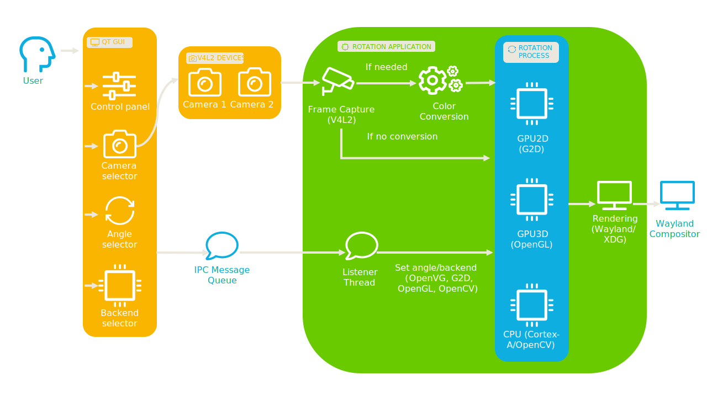
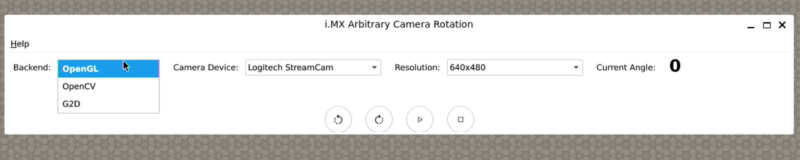
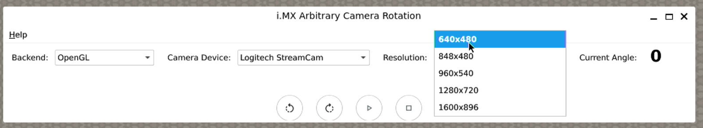
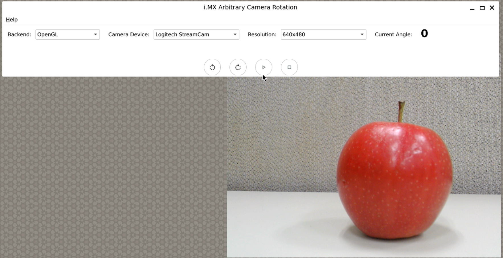
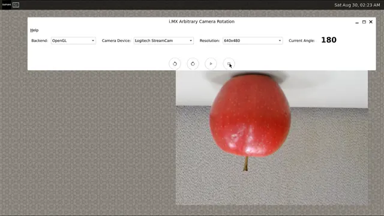

# Video Rotation Acceleration on i.MX Platforms

<!----- Boards ----->

[](https://bitbucket.sw.nxp.com/projects/MAG/repos/imx-camera-rotation/browse/licenses/BSD-3-Clause.txt)
[](https://www.nxp.com/products/processors-and-microcontrollers/arm-processors/i-mx-applications-processors/i-mx-8-applications-processors/i-mx-8m-plus-arm-cortex-a53-machine-learning-vision-multimedia-and-industrial-iot:IMX8MPLUS)
[](https://www.nxp.com/products/processors-and-microcontrollers/arm-processors/i-mx-applications-processors/i-mx-9-processors/i-mx-95-applications-processor-family-arm-cortex-a55-ml-acceleration-power-efficient-mpu:i.MX95)
[](https://www.nxp.com/products/i.MX8MMINI)
[](https://www.nxp.com/products/i.MX8ULP)
 
 


[*Video Rotation Acceleration*](https://github.com/nxp-imx-support/imx-camera-rotation) demonstrates methods to accelerate video rotation on NXP i.MX platforms, enabling more stable and readable video streams from moving cameras—particularly useful in medical or industrial inspection scenarios where cameras are hand-held or rotating.



>**NOTE:** This block diagram is simplified and do not represent the complete Video Rotation Accelarationn implementation. Some elements were omitted and only the key elements are shown.

## Table of Contents
  - [1 Motivation](#1-motivation)
  - [2 Software](#2-software)
  - [3 Hardware](#3-hardware)
  - [4 Build](#4-build)
  - [5 Features](#5-features)
  - [6 Pipeline](#6-pipeline)
  - [7 Limitations](#7-limitations)
  - [8 Usage](#8-usage)
  - [9 Results](#9-results)
  - [10 FAQs](#10-faqs)
  - [11 Support](#11-support)
  - [12 Release Notes](#12-release-notes)


## 1 Motivation
When a camera is mounted on a rotating surface (e.g., surgical tools or pipe-inspection robots), its video stream may rotate continuously. To maintain orientation and provide a stable visual output, the system must rotate the video stream dynamically, based on sensor input (e.g., accelerometer).

The purpose of this demo is to show how an input video stream can be dynamically rotated. Instead of using a sensor to provide the view angle correction, a GUI will provide the user with the controls to select a rotation view angle.

## 2 Software

*Video Rotation Acceleration* is part of Linux BSP at [GoPoint](https://www.nxp.com/design/design-center/software/i-mx-developer-resources/gopoint-for-i-mx-applications-processors:GOPOINT).


i.MX Board          | Main Software Components
---                 | ---
**i.MX 8M Plus EVK** | OpenCV + OpenGL + Qt6
**i.MX 95 EVK**      | OpenCV + OpenGL + Qt6
**i.MX 8M Mini EVK** | OpenCV + OpenGL + Qt6
**i.MX 8 ULP EVK**   | OpenCV + OpenGL + Qt6

>**NOTE:** If you are building the BSP using Yocto Project instead of downloading the pre-built BSP, make sure the BSP is built for *imx-image-full*, otherwise GoPoint is not included. The Video Rotation Acceleration software is only available in *imx-image-full*.

## 3 Hardware
To test *Video Rotation Acceleration*, either i.MX 8M Mini, i.MX 8M Plus, i.MX 8ULP or i.MX 95 platforms are required with their respective hardware components.

Component                                         | i.MX 8M Plus       |  i.MX 95            | i.MX 8M Mini       | i.MX 8 ULP
---                                               | :---:              | :---:               | :---:              | :---: 	       |
Power Supply                                      | :white_check_mark: | :white_check_mark:  | :white_check_mark: | :white_check_mark: |
HDMI Display                                      | :white_check_mark: | :white_check_mark:  | :white_check_mark: | 		       |
USB micro-B cable (Type-A male to Micro-B male)   | :white_check_mark: |                     | :white_check_mark: | :white_check_mark: |
USB Type-C cable  (Type-A male to Type-C male)    |                    | :white_check_mark:  |                    |		       |
HDMI cable                                        | :white_check_mark: | :white_check_mark:  | :white_check_mark: |		       |
IMX-MIPI-HDMI (MIPI-DSI to HDMI adapter)          | :white_check_mark: | :white_check_mark:  | :white_check_mark: |		       |
Mouse                                             | :white_check_mark: | :white_check_mark:  | :white_check_mark: | :white_check_mark: |
LVDS Display                                      | :white_check_mark: | :white_check_mark:  | :white_check_mark: | :white_check_mark: |
CSI Camera                                        | :white_check_mark: | :white_check_mark:  | :white_check_mark: | :white_check_mark: |
RK055 Display                                     |                    |                     |                    | :white_check_mark: |
Jumper for RK055 Display                          |                    |                     |                    | :white_check_mark: |


## 4 Build

To build the *Video Rotation Acceleration* application, some setup needs to be done manually.

Clone the repository:
```bash
mkdir Video_Rotation
cd Video_Rotation
git clone https://github.com/nxp-imx-support/imx-camera-rotation.git
cd imx-camera-rotation
```

Build the GUI.

To build the GUI, a toolchain that includes an SDK generated for a image-full is required.
```bash
source /opt/fsl-imx-xwayland/6.12-walnascar/environment-setup-armv8a-poky-linux

mkdir build
cmake -D CMAKE_BUILD_TYPE=Release -D CMAKE_EXPORT_COMPILE_COMMANDS=ON -S ./ -B build/
cmake --build build
```

Compile the project:

```bash
source /opt/fsl-imx-xwayland/6.12-walnascar/environment-setup-armv8a-poky-linux

cd demos
make -j8
```

After compiling the GUI and Demos, if the Video Rotation Acceleration isn't already on GoPoint, you should send the following binary files:
```bash
imx-camera-rotation-g2d
imx-camera-rotation-opencv
imx-camera-rotation-opengl
```
to the EVK directory:
```bash
/opt/gopoint-apps/scripts/multimedia/imx-camera-rotation/demos
```

And finally send the GUI binary to home on the EVK.

## 5 Features
* Rotation Acceleration Techniques:
* G2D (using GPU2D).
* Limited to 0°, 90°, 180° and 270° rotations.
* GPU3D (via OpenGL).
* Supports arbitrary angle rotation.
* CPU (via OpenCV) Used as a baseline, not hardware accelerated.
* Qt-based GUI.
* Buttons to rotate left or right.
* Dropdown to select rotation backend (CPU, G2D, GPU3D).
* Dropdown to select input camera.
* IPC via Message Queues:
* GUI communicates with backend rotation application.
* Sends control commands (rotation direction, angle, start/stop) Video Rotation Acceleration on i.MX Platforms.

## 6 Pipeline
1. Capture Stage:
   * Use V4L2 to open camera stream.
2. Processing Stage:
   * G2D: via G2D API (GPU2D).
   * GPU3D: via OpenGL.
   * CPU: via OpenCV.
3. Display Stage:
   * Output sent to Wayland compositor (using XDG protocol).

## 7 Limitations
* G2D only supports 0°, 90°, 180° and 270° rotations.
* CPU is slower and mainly for testing or comparison.
* G2D Platform support may vary for GPU2D.

## 8 Usage
1. Launch the GUI application.
2. Choose the rotation backend (OpenCV, G2D, OpenGL).
   
   In the case of using G2D the rotation ranges can be seen as:

   Angle range          | Rotation  |
   :---:                | :---:     | 
   From 0° to 89°       | 0°        |
   From 90° to 179°     | 90°       |
   From 180° to 269°    | 180°      |
   From 270° to 359°    | 270°      |

3. Select the desired input camera. 
4. Control the rotation using GUI buttons.
5. Observe the live rotated video in the output window.

## 9 Results

Run the Video Rotation Acceleration, if using the debug console run with:
```bash
./camera_rotation
```
Select the backend in which you want to run the application and the camera that you're using.



Select the desired resolution for the video.



Click on play to show the video stream.



Rotate the video to the rigth.


Rotate the video to the left.


Close the application.




## 10 FAQs

### Is the source code of Video Rotation Acceleration available?
Yes, the source code is available under the [BSD_3_Clause](./licenses/BSD-3-Clause.txt) license at https://bitbucket.sw.nxp.com/projects/MAG/repos/imx-camera-rotation/browse.

### How to fully stop the Video Rotation Acceleration application?
The demo can be stopped normally by clicking X in the top-right corner of the window. If the application was Launched via GoPoint, the "Stop Current Demo" button also can be used to stop the application.

### What device tree supports the Video Rotation Acceleration application?
The Video Rotation Acceleration application requires a display to be connected to the EVK and a camera. Make sure that the device tree selected supports camera input and display output.

For i.MX 95 EVK using LVDS->HDMI adapter the following DTBs can be used imx95-19x19-evk-it6263-lvds0.dtb or imx95-19x19-evk-it6263-lvds1.dtb depending on LVDS interface in use.

## 11 Support
Questions regarding the content/correctness of this example can be entered as Issues within this GitHub repository.

>**Warning**: For more general technical questions, enter your questions on the [NXP Community Forum](https://community.nxp.com/)

[](https://www.youtube.com/NXP_Semiconductors)
[](https://www.linkedin.com/company/nxp-semiconductors)
[](https://www.facebook.com/nxpsemi/)
[](https://twitter.com/NXP)

## 12 Release Notes
Version | Description                         | Date
---     | ---                                 | ---
1.0.0   | Initial release                     | October 01<sup>st</sup> 2025

### Licensing
*Video Rotation Acceleration* is licensed under:
* [BSD_3_Clause](./licenses/BSD-3-Clause.txt).
